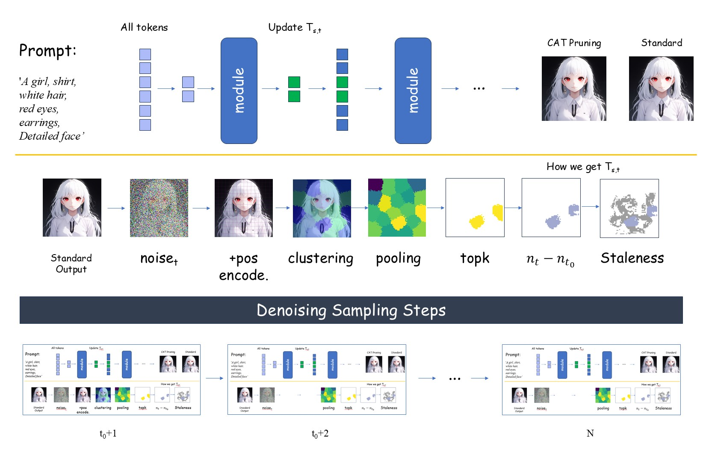
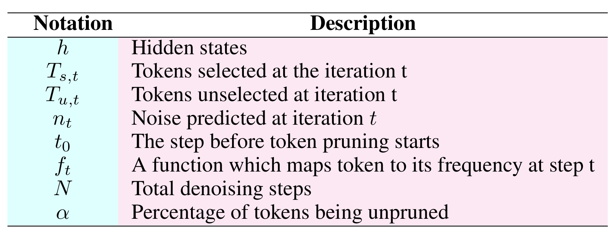

# CAT-Pruning

#### [[Project Website]](https://github.com/ada-cheng/CAT-Pruning) [[Paper]](https://github.com/ada-cheng/CAT-Pruning)

[Xinle Cheng<sup>1</sup>](https://ada-cheng.github.io), [Zhuoming Chen<sup>2</sup>](https://dreaming-panda.github.io/), [ Zhihao Jia<sup>2</sup>](https://www.cs.cmu.edu/~zhihaoj2/)<br/>
<sup>1</sup>Peking University <sup>2</sup>Carnegie Mellon University</br>

This is the code base for our paper [CAT Pruning: Cluster-Aware Token Pruning For
 Text-to-Image Diffusion Models](https://github.com/ada-cheng/CAT-Pruning).

## Overview
 

## Typical Notations

 

## Environment Set Up

Run `conda create python=3.9 -n cat-pruning` to create environment. Run `conda activate cat-pruning` to activate this environment.

Install dependencies :

```
pip install diffusers["torch"] transformers
pip install torch-scatter 
pip install torch-geometric 
pip install kmeans_pytorch datasets sentencepiece
pip install protobuf 
pip install scikit-learn
```


## Run CAT Pruning with `torch.compile`

In [`example_sd3_graph.py`](example_sd3_graph.py), we provide an example that prunes 70%
 tokens, where $t_0$ = 8,$N$ = 28.

 ```python
import torch

from qcache_compile.pipelines import QCacheSD3Pipeline
from qcache_compile.utils import QCacheConfig

from datasets import load_dataset

torch._inductor.config.conv_1x1_as_mm = True
torch._inductor.config.coordinate_descent_tuning = True
torch._inductor.config.epilogue_fusion = False
torch._inductor.config.coordinate_descent_check_all_directions = True

prompts = ['A girl, shirt, white hair, red eyes, earrings, Detailed face'] * 3

stop_idx_dict = {   
    'joint_attn': 5,
    'ff': 5,
    'proj': 5,
}

select_mode = {
    'joint_attn':'convergence_t_noise',
    'ff' : 'convergence_t_noise',
    'proj': 'convergence_stale_cpp'
}

select_factor = {   
    'joint_attn': 0.3,
    'ff': 0.3,
    'proj': 0.3
}


qcache_config = QCacheConfig(height=1024, width=1024, 
                             select_mode= select_mode,
                             stop_idx_dict=stop_idx_dict,
                             select_factor=select_factor,
                             use_cuda_graph=True,)
pipeline = QCacheSD3Pipeline.from_pretrained(
    qcache_config=qcache_config,
    pretrained_model_name_or_path="stabilityai/stable-diffusion-3-medium-diffusers",
    variant="fp16",
    use_safetensors=True,
)


# Compile the Transformer and VAE.


pipeline.pipeline.transformer.to(memory_format=torch.channels_last)
pipeline.pipeline.vae.to(memory_format=torch.channels_last)
pipeline.pipeline.transformer.forward_6 = torch.compile(pipeline.pipeline.transformer.forward_6, mode="reduce-overhead", fullgraph=True)
pipeline.pipeline.transformer = torch.compile(pipeline.pipeline.transformer, mode="reduce-overhead", fullgraph=True)
for i in range(24): 
    pipeline.pipeline.transformer.transformer_blocks[i].forward_8 = torch.compile(pipeline.pipeline.transformer.transformer_blocks[i].forward_8,  mode="reduce-overhead", fullgraph=True)
    pipeline.pipeline.transformer.transformer_blocks[i].forward_7 = torch.compile(pipeline.pipeline.transformer.transformer_blocks[i].forward_7,  mode="reduce-overhead", fullgraph=True)

pipeline.pipeline.vae.decode = torch.compile(pipeline.pipeline.vae.decode, mode="reduce-overhead",fullgraph=True)


torch.manual_seed(3407)
torch.cuda.manual_seed(3407)

for prompt in prompts:
    image = pipeline.generate(
        prompt=prompt,
        generator=torch.Generator(device="cuda").manual_seed(0),
        num_inference_steps=28,
        guidance_scale=7.0,
       
    )[0]

    image.save(f'girl.png')

```

## Try Different Pruning Strategies
We hard code the pruning configuration in the [`qcache_compile`](./qcache_compile) version, to try different pruning configurations, i.e. try different $\alpha$, we provide another version without combining `torch.compile` in [`qcache`](./qcache).

```python
import torch

from qcache.pipelines import QCacheSD3Pipeline
from qcache.utils import QCacheConfig

torch._inductor.config.conv_1x1_as_mm = True
torch._inductor.config.coordinate_descent_tuning = True
torch._inductor.config.epilogue_fusion = False
torch._inductor.config.coordinate_descent_check_all_directions = True

prompts = ['A girl, shirt, white hair, red eyes, earrings, Detailed face']*3 

stop_idx_dict = {   
    'joint_attn': 5,
    'ff': 5,
    'proj': 5,
}

select_mode = {
    'joint_attn':'convergence_t_noise',
    'ff' : 'convergence_t_noise',
    'proj': 'convergence_stale_cpp' # cpp is abbreviation for cluster + pooling * 2
}

select_factor = {   
    'joint_attn': 0.3,
    'ff': 0.3,
    'proj': 0.3
}

qcache_config = QCacheConfig(height=1024, width=1024, 
                             select_mode= select_mode,
                             stop_idx_dict=stop_idx_dict,
                             select_factor=select_factor)

pipeline = QCacheSD3Pipeline.from_pretrained(
    qcache_config=qcache_config,
    pretrained_model_name_or_path="stabilityai/stable-diffusion-3-medium-diffusers",
    variant="fp16",
    use_safetensors=True,
)


pipeline.set_progress_bar_config(disable=False)


torch.manual_seed(3407)
torch.cuda.manual_seed(3407)

for i, prompt in enumerate(prompts):
    image = pipeline.generate(
        prompt=prompt,
        generator=torch.Generator(device="cuda").manual_seed(3407),
        num_inference_steps=28,
        guidance_scale=7.0,
    )[0]
    image.save(f'girl.png')

```

## Citation 
If CAT Pruning is useful or relevant to your research, please kindly recognize our contributions by citing our paper: